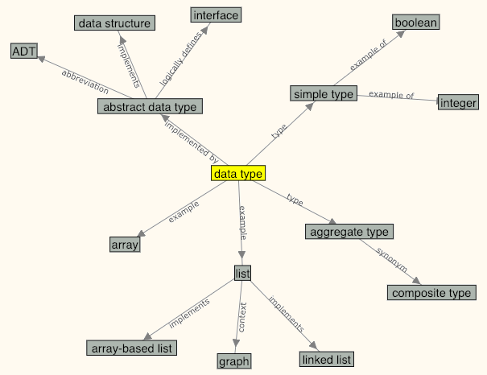

### Quiz: Data Types Concept Map

:::::::::::::::::::::::::::::::::::::::: quiz ::::::::::::::::::::::::::::::::::::::::

:::::::::: question ::::::::::
"Data type" and "data structure" are synonyms.

- [x] False
- [ ] True

::: hints
- Look at these terms on the concept map.
:::
::::::::::::::::::::::::::::::

:::::::::: question ::::::::::
It is correct to say that interfaces are abstract data types.

- [ ] True
- [x] False

::: hints
- Look at these terms on the concept map.
:::
::::::::::::::::::::::::::::::

:::::::::: question ::::::::::
The term "composite type" is a synonym of...

- [x] Aggregate type
- [ ] Data type
- [ ] Abstract data type
- [ ] Interface

::: hints
- Look at these terms on the concept map.
:::
::::::::::::::::::::::::::::::

:::::::::: question ::::::::::
Which of the following is NOT an example of a data type?

- [ ] Array
- [ ] List
- [ ] Integer
- [ ] Boolean
- [x] None of the above

::: hints
- Look at these terms on the concept map.
:::
::::::::::::::::::::::::::::::

:::::::::: question ::::::::::
An abstract data type implements a(n)...

- [x] Data structure
- [ ] ADT
- [ ] Data type
- [ ] Data item

::: hints
- Look at these terms on the concept map.
:::
::::::::::::::::::::::::::::::

:::::::::: question ::::::::::
An integer variable is an example of a(n) ________

- [x] Simple data type
- [ ] Array
- [ ] Composite type
- [ ] List

::: hints
- Look at these terms on the concept map.
:::
::::::::::::::::::::::::::::::

:::::::::: question ::::::::::
An array-based list is an implementation of a(n)...

- [x] List
- [ ] Array
- [ ] Linked list
- [ ] Graph

::: hints
- Look at these terms on the concept map.
:::
::::::::::::::::::::::::::::::

:::::::::: question ::::::::::
An abstract data type logically defines a(n)...

- [x] Interface
- [ ] Class
- [ ] Data structure
- [ ] Method

::: hints
- Look at these terms on the concept map.
:::
::::::::::::::::::::::::::::::

::::::::::::::::::::::::::::::::::::::::::::::::::::::::::::::::::::::::::::::::::::::::::

### ADTs: Summary Questions

:::::::::::::::::::::::::::::::::::::::: quiz ::::::::::::::::::::::::::::::::::::::::

:::::::::: question ::::::::::
An *ADT* is: 

- [x] The specification of a data type within some language, independent of an implementation
- [ ] A concrete implementation of a class
- [ ] An implementation for a data structure in a program
- [ ] A collection of values
- [ ] Another name for a data structure

::: hints
- A collection of values is a data type, not an ADT.
- It can't be a data structure, since an ADT is more like the interface for a data structure.
- An implementation for a data structure in a program is close, but not really it. An ADT is more abstract than an actual program.
:::
::::::::::::::::::::::::::::::

:::::::::: question ::::::::::
An ADT is a form of:

- [x] Abstraction
- [ ] Metaphor
- [ ] Simile
- [ ] Programming
- [ ] Design

::: hints
- What does the "A" stand for in ADT?
:::
::::::::::::::::::::::::::::::

:::::::::: question ::::::::::
Which is an example of a composite type?

- [x] A bank account record
- [ ] An integer
- [ ] A floating point number
- [ ] A character

::: hints
- A composite type is made up of two or more simple types.
- Character, Integer, and floating point numbers are all simple types.
:::
::::::::::::::::::::::::::::::

:::::::::: question ::::::::::
A *composite type* is:

- [x] A type comprised of other types
- [ ] A type composed from at least one simple type
- [ ] Another term for an Abstract Data Type
- [ ] An instance of a class

::: hints
- A type with only 1 simple type is just a simple type. There is a better answer to this question.
- An ADT is the realization of a data type, including the type and the operations allowed on the type.
- An object is an instance of a class.
:::
::::::::::::::::::::::::::::::

:::::::::: question ::::::::::
A *data item* is:

- [x] A member of a type
- [ ] A specification of a type within some language
- [ ] An implementation of an ADT
- [ ] An object instantiated from a class

::: hints
- An ADT is the specification of a data type within some language, independent of an implementation.
- A data structure is the implementation of an ADT.
- In OO programming, an ADT and its implementation together form a class. 
An object is an instance of a class. A data item is a member of the class.
- A data item is a piece of information whose value is drawn from a type.
:::
::::::::::::::::::::::::::::::

:::::::::: question ::::::::::
A *data structure* is:

- [x] The implementation for an ADT
- [ ] A specification for an implementation
- [ ] A collection of values
- [ ] A type
- [ ] Another name for an ADT

::: hints
- A data structure is not an ADT.
- A data structure is not a type (which is also a collection of values).
:::
::::::::::::::::::::::::::::::

:::::::::: question ::::::::::
An ADT is most like which of the following?

- [x] An interface
- [ ] A data structure
- [ ] A class
- [ ] An object
- [ ] A method
- [ ] A program

::: hints
- A data structure, program, class, or method are all concrete implementation.
- An object is something created at runtime.
:::
::::::::::::::::::::::::::::::

:::::::::: question ::::::::::
In computer science a *metaphor* is:

- [x] A label applied to a group of concepts
- [ ] A figure of speech in which a phrase is applied to an object to which it is not literally applicable
- [ ] The model of a type
- [ ] A comparison that does not use the word 'like'

::: hints
- In English a metaphor may refer to a word or a phrase, but this is not how the word is used in computer science.
- The model of a type is another term for an ADT.
- In computer science a metaphor is more than a comparison.
:::
::::::::::::::::::::::::::::::

:::::::::: question ::::::::::
A *simple type* is:

- [x] A type that cannot be broken down into smaller types
- [ ] The simplest type in a class
- [ ] The model of a type
- [ ] A subset of a type

::: hints
- A class may have more than one, or only simple types as members.
- The model of a type is another way to define an ADT.
- Any type is a collection of values and therefore, a subset of another type.
:::
::::::::::::::::::::::::::::::

:::::::::: question ::::::::::
A *type* is:

- [x] A collection of values
- [ ] A variable
- [ ] An integer
- [ ] An implementation
- [ ] Another name for an ADT

::: hints
- A type is a general concept, so it is not an integer, or an implementation, or a variable.
- A type has values. An ADT is a collection of actions on an object (a type).
:::
::::::::::::::::::::::::::::::

::::::::::::::::::::::::::::::::::::::::::::::::::::::::::::::::::::::::::::::::::::::::::
