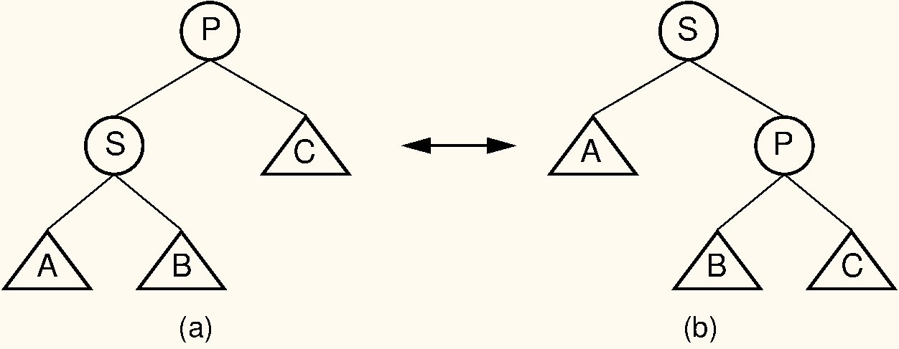
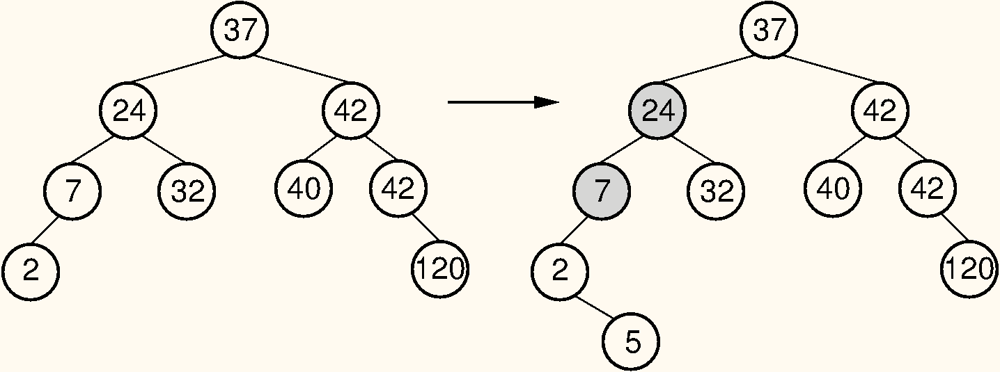
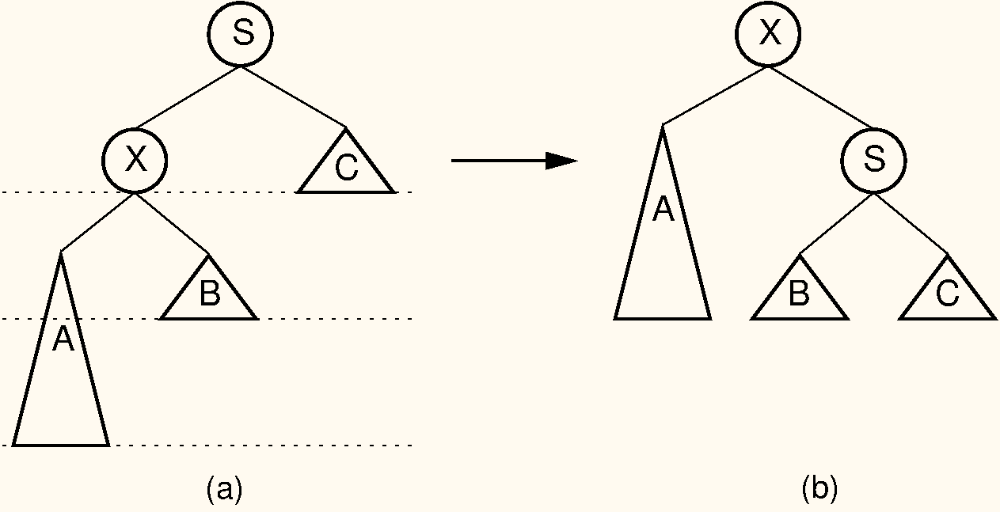
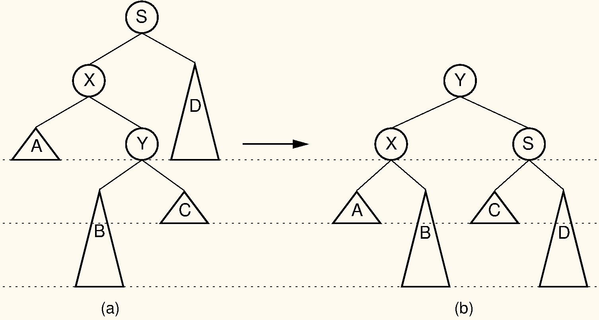

## The AVL Tree

The AVL tree is a BST with the following additional property: For every
node, the heights of its left and right subtrees differ by at most 1. As
long as the tree maintains this property, if the tree contains $n$
nodes, then it has a depth of at most $O(\log n)$. As a result, search
for any node will cost $O(\log n)$, and if the updates can be done in
time proportional to the depth of the node inserted or deleted, then
updates will also cost $O(\log n)$, even in the worst case.

The key to making the AVL tree work is to alter the insert and delete
routines so as to maintain the balance property. Of course, to be
practical, we must be able to implement the revised update routines in
$\Theta(\log n)$ time. To maintain the balance property, we are going to
use what are called [rotations](#rotation){.term}.

### Rotations

Rotation is an operation that takes a node in the tree and moves it one
level higher. [Figure #SingleRotation](#SingleRotation)
illustrates rotation. Here, $P$ and $S$ are nodes, while $A$, $B$ and
$C$ represent subtrees.

In Figure (a), node $S$ is the left child of the root. A *right rotation* 
transforms it into the tree shown in Figure (b), 
where node $S$ has become the root. Note that, because the value of
$S$ is less than the value of $P$, $P$ must become $S$'s right child.
Right rotation means transforming a tree from having the shape in (a) to
having the shape in (b).

A *left rotation* is the opposite process: starting from the tree in
(b), transforming it to the tree in (a), by lifting node $P$ up. Notice
that a right rotation tends to make the tree more right-leaning, while a
left rotation tends to make it more left-leaning.

:::: {#SingleRotation}
::: figure
{width=500}

In a rotation, node $S$ is promoted to the root, rotating with
node $P$. Because the value of $S$ is less than the value of $P$, $P$
must become $S$ 's right child. The positions of subtrees $A$, $B$, and
$C$ are altered as appropriate to maintain the BST property, but the
contents of these subtrees remains unchanged. (a) The original tree with
$P$ as the parent. (b) The tree after a rotation takes place.

Going from (a) to (b) is called a *right rotation*. We can also go from
(b) to (a) promoting node $P$ to the root -- this is called a *left
rotation*. In general, a right rotation makes the tree more
right-leaning, and a left rotation makes it more left-leaning.
:::
::::

### AVL tree insertion

:::: {#AVLinsert}
::: figure
{width=500}

Example of an insert operation that violates the AVL tree balance
property. Prior to the insert operation, all nodes of the tree are
balanced (i.e., the depths of the left and right subtrees for every node
differ by at most one). After inserting the node with value 5, the nodes
with values 7 and 24 are no longer balanced.
:::
::::

Consider what happens when we insert a node with key value 5, as shown
in [Figure #AVLinsert](#AVLinsert). The tree on
the left meets the AVL tree balance requirements. After the insertion,
two nodes no longer meet the requirements. Because the original tree met
the balance requirement, nodes in the new tree can only be unbalanced by
a difference of at most 2 in the subtrees. For the bottommost unbalanced
node, call it $S$, there are 4 cases:

(1) The extra node is in the left child of the left child of $S$.
(2) The extra node is in the right child of the left child of $S$.
(3) The extra node is in the left child of the right child of $S$.
(4) The extra node is in the right child of the right child of $S$.

Cases 1 and 4 are symmetric, as are cases 2 and 3. Note also that the
unbalanced nodes must be on the path from the root to the newly inserted
node.

Our problem now is how to balance the tree in $O(\log n)$ time. It turns
out that we can do this using a series of rotations. Cases 1 and 4 can
be fixed using a [single rotation]{.term}, as
shown in [Figure #AVLsingle](#AVLsingle). 
Cases 2 and 3 can be fixed using a [double rotation]{.term}, 
as shown in [Figure #AVLdouble](#AVLdouble).

:::: {#AVLsingle}
::: figure
{width=500}

A single rotation in an AVL tree. This operation occurs when the excess
node (in subtree $A$) is in the left child of the left child of the
unbalanced node labeled $S$. By rearranging the nodes as shown, we
preserve the BST property, as well as re-balance the tree to preserve
the AVL tree balance property. The case where the excess node is in the
right child of the right child of the unbalanced node is handled in the
same way.
:::
::::

:::: {#AVLdouble}
::: figure
{width=500}

A double rotation in an AVL tree. This operation occurs when the excess
node (in subtree $B$) is in the right child of the left child of the
unbalanced node labeled $S$. By rearranging the nodes as shown, we
preserve the BST property, as well as re-balance the tree to preserve
the AVL tree balance property. The case where the excess node is in the
left child of the right child of $S$ is handled in the same way.
:::
::::

The AVL tree insert algorithm begins with a normal BST insert. Then as
the recursion unwinds up the tree, we perform the appropriate rotation
on any node that is found to be unbalanced. Deletion is similar;
however, consideration for unbalanced nodes must begin at the level of
the *deleteMin* operation.

::: topic
#### Example: AVL insertion {-}

In [Figure #AVLinsert](#AVLinsert) (b), the
bottom-most unbalanced node has value 7. The excess node (with value 5)
is in the right subtree of the left child of 7, so we have an example of
Case 2. This requires a double rotation to fix. After the rotation, 5
becomes the left child of 24, 2 becomes the left child of 5, and 7
becomes the right child of 5.
:::

To try out AVL insertion yourself and see how it works, see [AVL Tree
Visualization](https://www.cs.usfca.edu/~galles/visualization/AVLtree.html).
You can also find a few more examples under [AVL
Trees](https://bradfieldcs.com/algos/trees/avl-trees/).

Here is an implementation of AVL trees:

    class AVLNode:
        AVLNode(key, value):
            this.key = key      // the key that are used for looking up values
            this.value = value  // the value associated with the key
            this.left = null    // the left subtree, initially null
            this.right = null   // the right subtree, initially null
            this.height = 1     // the height of this subtree

    class AVLMap implements Map:
        AVLMap():
            this.root = null
            this.treeSize = 0

        get(key):
            // Look up the value associated with a key.
            return this.getHelper(this.root, key)

        getHelper(node, key):
            // This is exactly the same as getHelper for BSTMap.
            if node is null:
                return null
            else if key < node.key:
                return this.getHelper(node.left, key)
            else if key > node.key:
                return this.getHelper(node.right, key)
            else:
                return node.value

        put(key, value):
            // Add a key-value pair, or update the value associated with an existing key. 
            // This is the same as BSTMap.put, except that it rebalances the node afterwards.
            this.root = this.putHelper(this.root, key, value)

        putHelper(node, key, value):
            // Recursive helper method for 'put', returns the updated node.
            if node is null:
                this.treeSize = this.treeSize + 1
                return new AVLNode(key, value)
            else if key < node.key:
                node.left = this.putHelper(node.left, key, value)
                this.updateHeight(node)
            else if key > node.key:
                node.right = this.putHelper(node.right, key, value)
                this.updateHeight(node)
            else: // key == node.key
                node.value = value
            return this.rebalance(node)

        remove(key):
            // Delete a key and its associated value.
            // This is the same as BSTMap.remove, except that it rebalances the node afterwards.
            this.root = this.removeHelper(this.root, key)

        removeHelper(node, key):
            // Helper method for 'remove', returns the updated node.
            if node is null:
                return null
            else if key < node.key:
                node.left = this.removeHelper(node.left, key)
                this.updateHeight(node)
                return this.rebalance(node)
            else if key > node.key:
                node.right = this.removeHelper(node.right, key)
                this.updateHeight(node)
                return this.rebalance(node)
            else: // key == node.key
                if node.left is null:
                    this.treeSize = this.treeSize - 1
                    return node.right
                else if node.right is null:
                    this.treeSize = this.treeSize - 1
                    return node.left
                else:
                    predecessor = this.largestNode(node.left)
                    old_value = node.value
                    node.key = predecessor.key
                    node.value = predecessor.value
                    node.left = this.removeHelper(node.left, predecessor.key)
                    this.updateHeight(node)
                    return this.rebalance(node)

        getHeight(node):
            // Return the height of a tree node, also works if the node is null.
            if node is null:
                return 0
            else:
                return node.height

        updateHeight(node):
            // Recompute the value of the height of a tree node.
            // Must be called every time the height could change.
            node.height = 1 + max(this.getHeight(node.left), this.getHeight(node.right))

        heightDiff(node):
            // Return the height difference of a node: left height - right height.
            return this.getHeight(node.left) - this.getHeight(node.right)

        largestNode(node):
            // Find the descendant node having the largest key.
            while node.right is not null:
                node = node.right
            return node

        rebalance(node):
            if node is null: 
                return null
            diff = this.heightDiff(node)
            if diff > 1:  // Left-leaning
                leftDiff = this.heightDiff(node.left)
                if leftDiff == -1:  // Left-right: convert to left-left
                    node.left = this.rotateLeft(node.left)
                    this.updateHeight(node)
                return this.rotateRight(node)
            else if diff < -1:  // Right-leaning
                rightDiff = this.heightDiff(node.right)
                if rightDiff == 1:  // Right-left: convert to right-right
                    node.right = this.rotateRight(node.right)
                    this.updateHeight(node)
                return this.rotateLeft(node)
            else:
                return node

        rotateLeft(x):
            // Left rotation.
            ("""      x                 y    
                     / \               / \   
                    A   y     ===>    x   C  
                       / \           / \     
                      B   C         A   B         """)
            // Variables are named according to the picture above.
            y = x.right
            B = y.left
            x.right = B
            y.left = x
            return y

        rotateRight(x):
            // Right rotation.
            ("""       x              y
                      / \            / \
                     y   C   ===>   A   x
                    / \                / \
                   A   B              B   C       """)
            // Variables are named according to the picture above.
            y = x.left
            B = y.right
            x.left = B
            y.right = x
            return y
