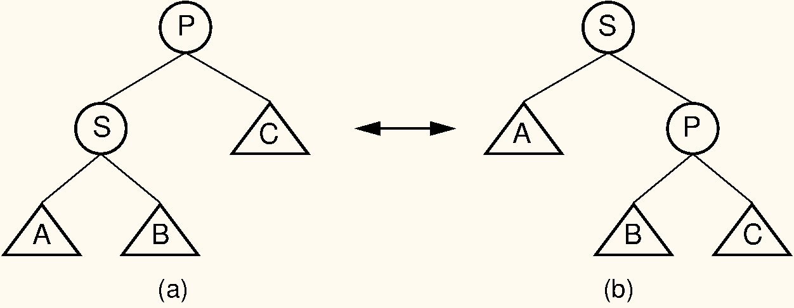
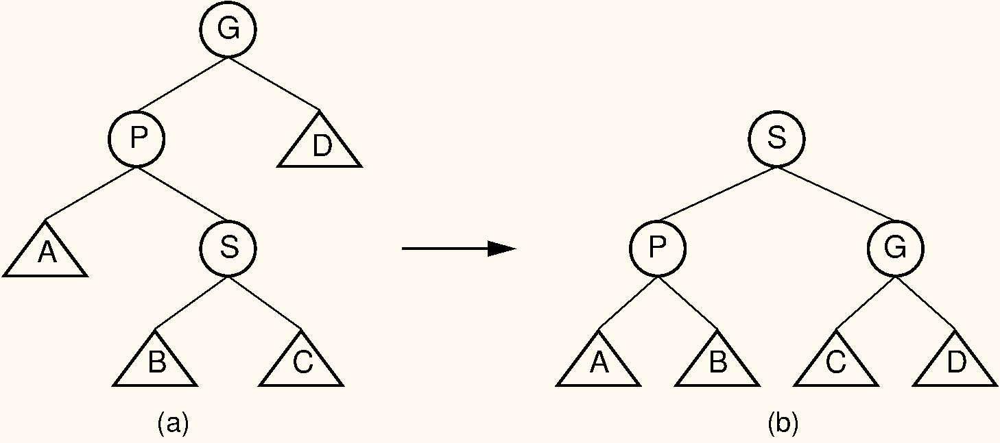
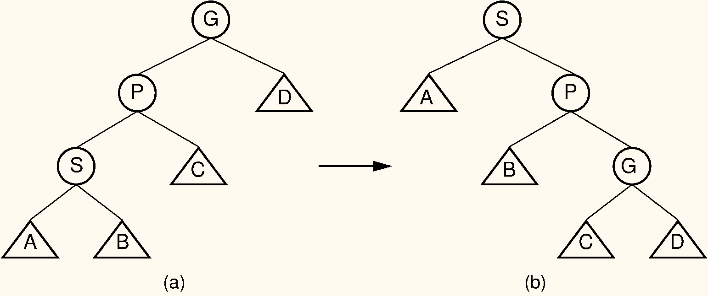

## The Splay Tree

Like the AVL tree, the splay tree is not actually a distinct data
structure, but rather reimplements the BST insert, delete, and search
methods to improve the performance of a BST. The goal of these revised
methods is to provide guarantees on the time required by a series of
operations, thereby avoiding the worst-case linear time behavior of
standard BST operations. No single operation in the splay tree is
guaranteed to be efficient. Instead, the splay tree access rules
guarantee that a series of $m$ operations will take $O(m log n)$ time
for a tree of $n$ nodes whenever $m \geq n$. Thus, a single insert or
search operation could take $O(n)$ time. However, $m$ such operations
are guaranteed to require a total of $O(m \log n)$ time, for an average
cost of $O(\log n)$ per access operation. This is a desirable
performance guarantee for any search-tree structure.

Unlike the AVL tree, the splay tree is not guaranteed to be height
balanced. What is guaranteed is that the total cost of the entire series
of accesses will be cheap. Ultimately, it is the cost of the series of
operations that matters, not whether the tree is balanced. Maintaining
balance is really done only for the sake of reaching this time
efficiency goal.

The splay tree access functions operate in a manner reminiscent of the
[move-to-front]{.term} rule for
[self-organizing lists](#self-organizing-list){.term}, 
and of the path compression technique for managing a series
of [Union/Find]{.term}
operations. These access functions tend to make the tree more balanced,
but an individual access will not necessarily result in a more balanced
tree.

Whenever a node $S$ is accessed (e.g., when $S$ is inserted, deleted, or
is the goal of a search), the splay tree performs a process called
[splaying]{.term}. Splaying moves $S$ to the
root of the BST. When $S$ is being deleted, splaying moves the parent of
$S$ to the root. As in the AVL tree, a splay of node $S$ consists of a
series of [rotations](#rotation){.term}. A
rotation moves $S$ higher in the tree by adjusting its position with
respect to its parent and grandparent. A side effect of the rotations is
a tendency to balance the tree. There are three types of rotation.

A [single rotation]{.term} is performed only if
$S$ is a child of the root node. The single rotation is illustrated by
[Figure #SingProm](#SingProm). It basically
switches $S$ with its parent in a way that retains the BST property.
While this figure is
slightly different from [Figure #AVLsingle](#AVLsingle), 
in fact the splay tree single rotation is identical to the
AVL tree single rotation.

:::: {#SingProm}
::: figure
{width=500}

Splay tree single rotation. This rotation takes place only when the node
being splayed is a child of the root. Here, node $S$ is promoted to the
root, rotating with node $P$. Because the value of $S$ is less than the
value of $P$, $P$ must become $S$ 's right child. The positions of
subtrees $A$, $B$, and $C$ are altered as appropriate
to maintain the BST property, but the contents of these subtrees remains
unchanged. (a) The original tree with $P$ as the parent. (b) The tree
after a rotation takes place. Performing a single rotation a second time
will return the tree to its original shape. Equivalently, if (b) is the
initial configuration of the tree (i.e., $S$ is at the root and $P$ is
its right child), then (a) shows the result of a single rotation to
splay $P$ to the root.
:::
::::

Unlike the AVL tree, the splay tree requires two types of double
rotation. Double rotations involve $S$, its parent (call it $P$), and
$S$ 's grandparent (call it $G$). The effect of a double rotation is to
move $S$ up two levels in the tree.

The first double rotation is called a $zigzag rotation$. It takes place
when either of the following two conditions are met:

(1) $S$ is the left child of $P$, and $P$ is the right child of $G$.
(2) $S$ is the right child of $P$, and $P$ is the left child of $G$.

In other words, a zigzag rotation is used when $G$, $P$, and $S$ form a
zigzag. The zigzag rotation is illustrated by 
[Figure #ZigZag](#ZigZag).

:::: {#ZigZag}
::: figure
{width=500}

Splay tree zigzag rotation. (a) The original tree with $S$, $P$, and $G$
in zigzag formation. (b) The tree after the rotation takes place. The
positions of subtrees $A$, $B$, $C$, and $D$ are altered as appropriate
to maintain the BST property.
:::
::::

The other double rotation is known as a [zigzig]{.term} rotation. A zigzig rotation takes place when either of the
following two conditions are met:

(1) $S$ is the left child of $P$, which is in turn the left child of
    $G$.
(2) $S$ is the right child of $P$, which is in turn the right child of
    $G$.

Thus, a zigzig rotation takes place in those situations where a zigzag
rotation is not appropriate. The zigzig rotation is illustrated by
[Figure #ZigZig](#ZigZig). While the figure appears somewhat
different from [Figure #AVLdouble](#AVLdouble),
in fact the zigzig rotation is identical to the AVL tree double
rotation.

:::: {#ZigZig}
::: figure
{width=500}

Splay tree zigzig rotation. (a) The original tree with $S$, $P$, and $G$
in zigzig formation. (b) The tree after the rotation takes place. The
positions of subtrees $A$, $B$, $C$, and $D$ are altered as appropriate
to maintain the BST property.
:::
::::

Note that zigzag rotations tend to make the tree more balanced, because
they bring subtrees $B$ and $C$ up one level while moving subtree $D$
down one level. The result is often a reduction of the tree's height by
one. Zigzig promotions and single rotations do not typically reduce the
height of the tree; they merely bring the newly accessed record toward
the root.

Splaying node $S$ involves a series of double rotations until $S$
reaches either the root or the child of the root. Then, if necessary, a
single rotation makes $S$ the root. This process tends to re-balance the
tree. Regardless of balance, splaying will make frequently accessed
nodes stay near the top of the tree, resulting in reduced access cost.
Proof that the splay tree meets the guarantee of $O(m \log n)$ is beyond
the scope of our study.

::: topic
#### Example {-}

Consider a search for value 89 in the splay tree of 
[Figure #SplayEx](#SplayEx) (a). The splay tree's
search operation is identical to searching in a BST. However, once the
value has been found, it is splayed to the root. Three rotations are
required in this example. The first is a zigzig rotation, whose result
is shown in figure (b).
The second is a zigzag rotation, whose result is shown in figure (c). 
The final step is a single rotation resulting in the tree of Figure (d). 
Notice that the splaying process has made the tree shallower.
:::

:::: {#SplayEx}
::: figure
{width=500}

Example of splaying after performing a search in a splay tree. After
finding the node with key value 89, that node is splayed to the root by
performing three rotations. (a) The original splay tree. (b) The result
of performing a zigzig rotation on the node with key value 89 in the
tree of (a). (c) The result of performing a zigzag rotation on the node
with key value 89 in the tree of (b). (d) The result of performing a
single rotation on the node with key value 89 in the tree of (c). If the
search had been for 91, the search would have been unsuccessful with the
node storing key value 89 being that last one visited. In that case, the
same splay operations would take place.
:::
::::
