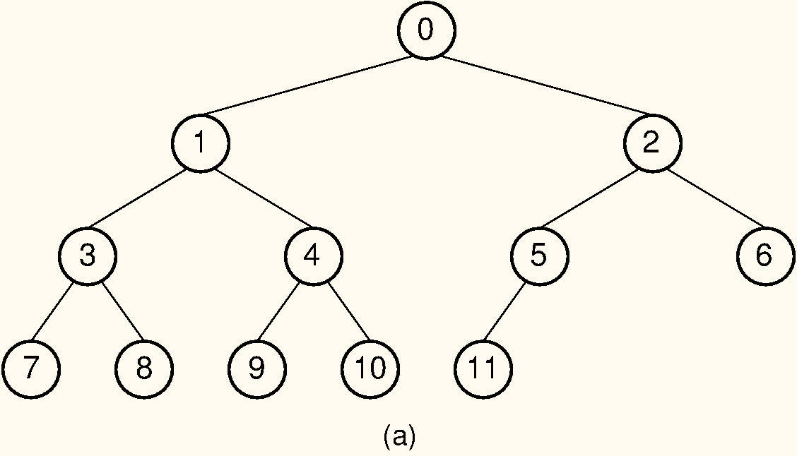

## Array Representation for Complete Binary Trees

From the [full binary tree theorem]{.term}, 
we know that a large fraction of the space in a typical
binary tree node implementation is devoted to structural
[overhead]{.term}, not to storing data. This
module presents a simple, compact implementation for
[complete binary trees](#complete-binary-tree){.term}. Recall that complete binary trees have all levels except
the bottom filled out completely, and the bottom level has all of its
nodes filled in from left to right. Thus, a complete binary tree of $n$
nodes has only one possible shape. You might think that a complete
binary tree is such an unusual occurrence that there is no reason to
develop a special implementation for it. However, the complete binary
tree has practical uses, the most important being the
[heap](#heaps-and-priority-queues) data structure. Heaps
are often used to implement
[priority queues](#priority-queue){.term} and
for [external sorting algorithms](#external-sort){.term}.

We begin by assigning numbers to the node positions in the complete
binary tree, level by level, from left to right as shown in 
[Figure #BinArray](#BinArray). An array can store the
tree's data values efficiently, placing each data value in the array
position corresponding to that node's position within the tree. The
table lists the array indices for the children, parent, and siblings of
each node in the figure.

:::: {#BinArray}
::: figure
{width=400}

A complete binary tree of 12 nodes, numbered starting from 0.
:::
::::

Here is a table that lists, for each node position, the positions of the
parent, sibling, and children of the node.

| Position      | 0  |  1 |  2 |  3 |  4 |  5 |  6 |  7 |  8 |  9 | 10 | 11 |
|:--------------|:--:|:--:|:--:|:--:|:--:|:--:|:--:|:--:|:--:|:--:|:--:|:--:|
| Parent        | -- |  0 |  0 |  1 |  1 |  2 |  2 |  3 |  3 |  4 |  4 |  5 |
| Left Child    | 1  |  3 |  5 |  7 |  9 | 11 | -- | -- | -- | -- | -- | -- |
| Right Child   | 2  |  4 |  6 |  8 | 10 | -- | -- | -- | -- | -- | -- | -- |
| Left Sibling  | -- | -- |  1 | -- |  3 | -- | 5  | -- |  7 | -- |  9 | -- |
| Right Sibling | -- |  2 | -- |  4 | -- |  6 | -- |  8 | -- | 10 | -- | -- |

Looking at the table, you should see a pattern regarding the positions
of a node's relatives within the array. Simple formulas can be derived
for calculating the array index for each relative of a node $R$ from
$R$'s index. No explicit pointers are necessary to reach a node's left
or right child. This means there is no overhead to the array
implementation if the array is selected to be of size $n$ for a tree of
$n$ nodes.

The formulae for calculating the array indices of the various relatives
of a node are as follows. The total number of nodes in the tree is $n$.
The index of the node in question is $r$, which must fall in the range 0
to $n-1$.

-   Parent($r$) $= \lfloor(r - 1)/2\rfloor$ if $r \neq 0$.
-   Left child($r$) $= 2r + 1$ if $2r + 1 < n$.
-   Right child($r$) $= 2r + 2$ if $2r + 2 < n$.
-   Left sibling($r$) $= r - 1$ if $r$ is even and $r \neq 0$.
-   Right sibling($r$) $= r + 1$ if $r$ is odd and $r + 1 < n$.

<avembed id="CompleteFIB" src="Binary/CompleteFIB.html" type="ka" name="Complete Tree Exercise"/>
