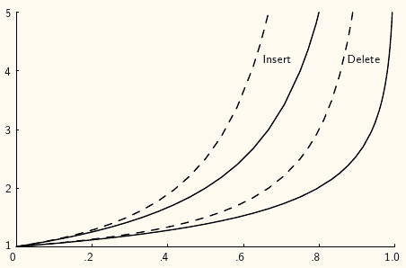

## Analysis of Open Addressing

How efficient is hashing? We can measure hashing performance in terms of
the number of record accesses required when performing an operation. The
primary operations of concern are insertion, deletion, and search. It is
useful to distinguish between successful and unsuccessful searches.
Before a record can be deleted, it must be found. Thus, the number of
accesses required to delete a record is equivalent to the number
required to successfully search for it. To insert a record, an empty
slot along the record's probe sequence must be found. This is
equivalent to an unsuccessful search for the record (recall that a
successful search for the record during insertion should generate an
error because two records with the same key are not allowed to be stored
in the table).

When the hash table is empty, the first record inserted will always find
its home position free. Thus, it will require only one record access to
find a free slot. If all records are stored in their home positions,
then successful searches will also require only one record access. As
the table begins to fill up, the probability that a record can be
inserted into its home position decreases. If a record hashes to an
occupied slot, then the collision resolution policy must locate another
slot in which to store it. Finding records not stored in their home
position also requires additional record accesses as the record is
searched for along its probe sequence. As the table fills up, more and
more records are likely to be located ever further from their home
positions.

From this discussion, we see that the expected cost of hashing is a
function of how full the table is. Define the
[load factor]{.term} for the table as
$\alpha = N/M$, where $N$ is the number of records currently in the
table.

An estimate of the expected cost for an insertion (or an unsuccessful
search) can be derived analytically as a function of $\alpha$ in the
case where we assume that the probe sequence follows a random
permutation of the slots in the hash table. Assuming that every slot in
the table has equal probability of being the home slot for the next
record, the probability of finding the home position occupied is
$\alpha$. The probability of finding both the home position occupied and
the next slot on the probe sequence occupied is $(N(N-1))/(M(M-1))$. The
probability of $i$ collisions is
$(N(N-1) ... (N-i+1))/(M(M-1) ... (M-i+1))$. If $N$ and $M$ are large,
then this is approximately $(N/M)^i$. The expected number of probes is
one plus the sum over $i >= 1$ of the probability of $i$ collisions,
which is approximately

$$
\begin{eqnarray}
1 + \sum_{i=1}^\infty (N/M)^i &=& 1/(1-\alpha)
\end{eqnarray}
$$

The cost for a successful search (or a deletion) has the same cost as
originally inserting that record. However, the expected value for the
insertion cost depends on the value of $\alpha$ not at the time of
deletion, but rather at the time of the original insertion. We can
derive an estimate of this cost (essentially an average over all the
insertion costs) by integrating from 0 to the current value of $\alpha$,
yielding a result of $(1/\alpha) \log_e 1/(1-\alpha).$

It is important to realize that these equations represent the expected
cost for operations when using the unrealistic assumption that the probe
sequence is based on a random permutation of the slots in the hash
table. We thereby avoid all the expense that results from a
less-than-perfect collision resolution policy. Thus, these costs are
lower-bound estimates in the average case. The true average cost under
linear probing is $\frac{1}{2}(1 + 1/(1-\alpha)^2)$ for insertions or
unsuccessful searches and $\frac{1}{2}(1 + 1/(1-\alpha))$ for deletions or
successful searches.

:::: {#HashPlot}
::: figure
{width=400}

A plot showing the growth rate of the cost for insertion and deletion
into a hash table as the load factor increases.
:::
::::

[Figure #HashPlot](#HashPlot) shows how the
expected number of record accesses grows as $\alpha$ grows. The
horizontal axis is the value for $\alpha$ , the vertical axis is the
expected number of accesses to the hash table. Solid lines show the cost
for "random" probing (a theoretical lower bound on the cost), while
dashed lines show the cost for linear probing (a relatively poor
collision resolution strategy). The two leftmost lines show the cost for
insertion (equivalently, unsuccessful search); the two rightmost lines
show the cost for deletion (equivalently, successful search).

From the figure, you should see that the cost for hashing when the table
is not too full is typically close to one record access. This is
extraordinarily efficient, much better than binary search which requires
$\log n$ record accesses. As $\alpha$ increases, so does the expected
cost. For small values of $\alpha$, the expected cost is low. It remains
below two until the hash table is about half full. When the table is
nearly empty, adding a new record to the table does not increase the
cost of future search operations by much. However, the additional search
cost caused by each additional insertion increases rapidly once the
table becomes half full. Based on this analysis, the rule of thumb is to
design a hashing system so that the hash table never gets above about
half full, because beyond that point performance will degrade rapidly.
This requires that the implementor have some idea of how many records
are likely to be in the table at maximum loading, and select the table
size accordingly. The goal should be to make the table small enough so
that it does not waste a lot of space on the one hand, while making it
big enough to keep performance good on the other.

<avembed id="HashAnalSumm" src="Hashing/HashAnalSumm.html" type="ka" name="Analysis of Open Addressing Summary Exercise"/>
